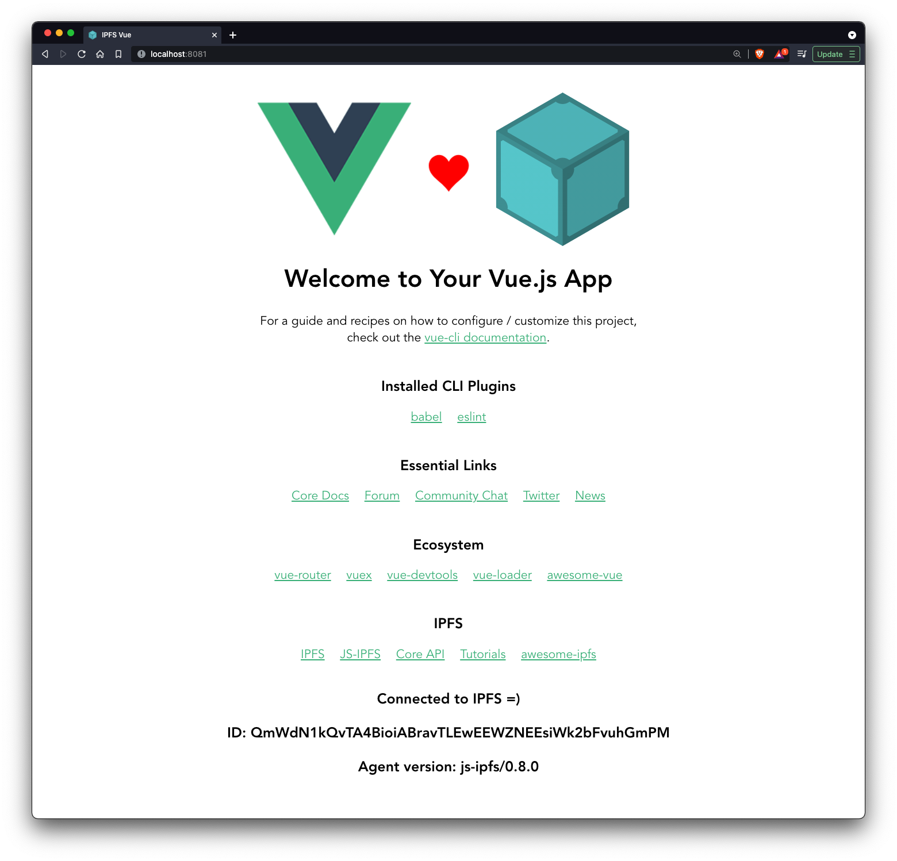

### Installation and Running example

```console
> npm install
> npm start
```

Now open your browser at `http://localhost:8081`

### Available Scripts from vue cli

In the project directory, you can run:

#### Compiles and hot-reloads for development

```console
$ npm run serve
```

#### Compiles and minifies for production

```console
$ npm run build
```

### Run your tests

```console
$ npm run test
```

#### Lints and fixes files

```console
$ npm run lint
```

#### Customize configuration

See [Configuration Reference](https://cli.vuejs.org/config/).

## Usage

A minimal demonstration of how to use `js-ipfs` with `Vue`.



This project was bootstrapped with [Vue CLI](https://cli.vuejs.org/).

_For more examples, please refer to the [Documentation](#documentation)_

## References

- Documentation:
  - [IPFS CONFIG](https://github.com/ipfs/js-ipfs/blob/master/docs/CONFIG.md)
  - [MISCELLANEOUS](https://github.com/ipfs/js-ipfs/blob/master/docs/core-api/MISCELLANEOUS.md)

## Documentation

- [Config](https://docs.ipfs.io/)
- [Core API](https://github.com/ipfs/js-ipfs/tree/master/docs/core-api)
- [Examples](https://github.com/ipfs-examples/js-ipfs-examples)
- [Development](https://github.com/ipfs/js-ipfs/blob/master/docs/DEVELOPMENT.md)
- [Tutorials](https://proto.school)

## Contributing

Contributions are what make the open source community such an amazing place to be learn, inspire, and create. Any contributions you make are **greatly appreciated**.

1. Fork the IPFS Project
2. Create your Feature Branch (`git checkout -b feature/amazing-feature`)
3. Commit your Changes (`git commit -a -m 'feat: add some amazing feature'`)
4. Push to the Branch (`git push origin feature/amazing-feature`)
5. Open a Pull Request

## Want to hack on IPFS?

[](https://github.com/ipfs/community/blob/master/CONTRIBUTING.md)

The IPFS implementation in JavaScript needs your help! There are a few things you can do right now to help out:

Read the [Code of Conduct](https://github.com/ipfs/community/blob/master/code-of-conduct.md) and [JavaScript Contributing Guidelines](https://github.com/ipfs/community/blob/master/CONTRIBUTING_JS.md).

- **Check out existing issues** The [issue list](https://github.com/ipfs/js-ipfs/issues) has many that are marked as ['help wanted'](https://github.com/ipfs/js-ipfs/issues?q=is%3Aissue+is%3Aopen+sort%3Aupdated-desc+label%3A%22help+wanted%22) or ['difficulty:easy'](https://github.com/ipfs/js-ipfs/issues?q=is%3Aissue+is%3Aopen+sort%3Aupdated-desc+label%3Adifficulty%3Aeasy) which make great starting points for development, many of which can be tackled with no prior IPFS knowledge
- **Look at the [IPFS Roadmap](https://github.com/ipfs/roadmap)** This are the high priority items being worked on right now
- **Perform code reviews** More eyes will help
  a. speed the project along
  b. ensure quality, and
  c. reduce possible future bugs.
- **Add tests**. There can never be enough tests.
- **Join the [Weekly Core Implementations Call](https://github.com/ipfs/team-mgmt/issues/992)** it's where everyone discusses what's going on with IPFS and what's next
